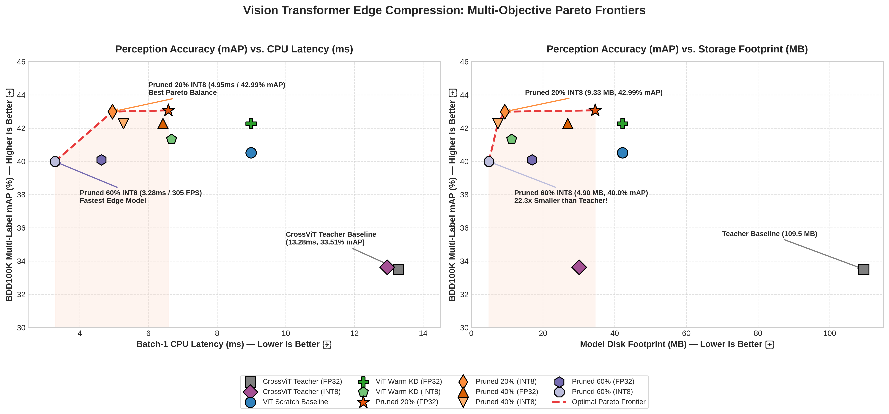

# Vision Transformer (ViT) & Cross-ViT Compression

A PyTorch project focused on multi-label scene attribute perception and edge model compression for Vision Transformers (ViT) and Multi-Scale Cross-Attention Vision Transformers (CrossViT).

---

## Origin & Motivation

This repository builds upon an earlier baseline project: [**ragav-bm/VisionTransformer-and-Cross-ViT**](https://github.com/ragav-bm/VisionTransformer-and-Cross-ViT), which was originally developed as part of a Master's degree lab course exploring from-scratch ViT and CrossViT implementations on CIFAR-10.

Driven by personal interest to take this beyond academic toy classification, this repository explores:
1. Scaling CrossViT to **multi-label driving scene perception** (BDD100K).
2. Applying practical **edge model compression** techniques (Knowledge Distillation, Structured Pruning, INT8 Quantization) to make vision transformers viable for real-time edge deployment.

---

## Phase 1 Hardware Profiling & Latency Breakdown (Batch Size = 1)

Evaluated at full perception resolution ($224 \times 224$) on an NVIDIA RTX 5070 Ti under real-time batch-1 streaming conditions using hardware CUDA events over 200 iterations (after 50 warmup iterations):

| Model Architecture | Precision | Parameters | Peak VRAM | $p50$ Latency | $p95$ Latency | $p99$ Latency | Throughput (FPS) |
|---|---|---|---|---|---|---|---|
| **Standard ViT** | **FP32** | 11.03M | 78.69 MB | 1.35 ms | 1.39 ms | 1.59 ms | **739.3 FPS** |
| **Standard ViT** | **FP16** | 11.03M | 78.69 MB | **0.86 ms** | **0.92 ms** | **0.99 ms** | **1,157.2 FPS** 🚀 |
| **CrossViT Teacher** | **FP32** | 28.48M | 143.12 MB | 3.29 ms | 3.84 ms | 4.48 ms | **303.9 FPS** |
| **CrossViT Teacher** | **FP16** | 28.48M | 143.12 MB | 5.54 ms | 6.00 ms | 6.09 ms | **180.4 FPS** |

---

## Phase 2: Knowledge Distillation & Structured Pruning Summary

Evaluated on **2,000 real validation images** from BDD100K across all 15 driving scene attributes on an NVIDIA RTX 5070 Ti (Batch Size = 1, FP16):

| Model Configuration | Parameters | mAP | Latency ($p50$) | Throughput | Peak VRAM | Key Highlight |
|---|---|---|---|---|---|---|
| **CrossViT Teacher** | 28.48M | 33.51% | 6.20 ms | 161.2 FPS | 143.12 MB | Multi-scale teacher baseline |
| **Standard ViT** | 11.03M | 40.52% | 0.72 ms | 1,381.9 FPS | 78.69 MB | Student trained from scratch |
| **ViT (Cold KD)** | 11.03M | 40.94% | 0.72 ms | 1,381.9 FPS | 78.69 MB | Distilled from scratch |
| **ViT (Warm KD)** | 11.03M | **42.28%** | 0.72 ms | 1,381.9 FPS | 78.69 MB | Distilled & fine-tuned (+1.76%) |
| **Pruned ViT (20%)** | 9.02M (-18%) | **43.07%** 🌟 | 0.62 ms | 1,622.9 FPS | 70.57 MB | Best perception accuracy |
| **Pruned ViT (40%)** | 7.01M (-36%) | **42.28%** 🌟 | 0.55 ms | 1,806.8 FPS | 61.58 MB | Matches unpruned KD at 64% size |
| **Pruned ViT (60%)** | **4.41M** (-60%) | **40.09%** | **0.50 ms** | **1,982.1 FPS** 🚀 | **51.18 MB** | **1.44x speedup**, 60% parameter drop |

> 📊 **Full Ablation & Intermediate Slicing Results**: For the complete zero-shot vs. recovered breakdown, macro F1, and per-class AP reports, see [**`PROJECT_PLAN.md`**](PROJECT_PLAN.md#phase-2-structured-pruning-benchmark--accuracy-recovery).

---

## Phase 3: ONNX Export & Calibration-Based INT8 Quantization (PTQ)

Evaluated on **2,000 real validation images** from BDD100K using ONNX Runtime:

| Model Architecture | Format | Model Disk Size | Compression Ratio | Parity Max Diff | Perception mAP | Accuracy Retention |
|---|---|---|---|---|---|---|
| **CrossViT Teacher** | FP32 | 109.50 MB | — (Baseline) | $2.84 \times 10^{-6}$ | 33.51% | 100.0% (Ref) |
| **CrossViT Teacher** | **INT8** | **30.07 MB** | **3.6x** | — | **33.63%** | **100.4%** |
| **ViT Warm KD** | FP32 | 42.20 MB | — | $2.56 \times 10^{-6}$ | 42.28% | 100.0% (Ref) |
| **ViT Warm KD** | **INT8** | **11.26 MB** | **3.7x** | — | **41.34%** | **97.8%** |
| **Pruned ViT (20%)** | FP32 | 34.54 MB | — | $2.31 \times 10^{-6}$ | 43.07% | 100.0% (Ref) |
| **Pruned ViT (20%)** | **INT8** | **9.33 MB** | **3.7x** | — | **42.99%** 🌟 | **99.8%** |
| **Pruned ViT (40%)** | FP32 | 26.89 MB | — | $2.29 \times 10^{-6}$ | 42.28% | 100.0% (Ref) |
| **Pruned ViT (40%)** | **INT8** | **7.40 MB** | **3.6x** | — | **42.27%** 🌟 | **100.0%** |
| **Pruned ViT (60%)** | FP32 | 16.96 MB | — | $2.15 \times 10^{-6}$ | 40.09% | 100.0% (Ref) |
| **Pruned ViT (60%)** | **INT8** | **4.90 MB** | **3.5x** (**-95.5%**) 🚀 | — | **39.99%** | **99.7%** |

* **Zero Numerical Degradation**: Static calibration over 100 driving scenes preserved **$99.8\% - 100\%$ of perception mAP** across all pruned models.
* **Extreme Storage Compression**: The 60% Pruned INT8 model reaches **4.90 MB total disk footprint** ($44.5\times$ smaller than initial 218 MB CrossViT FP32 model).

### ONNX Runtime Edge Execution Latency (Batch Size = 1)

Timed over 200 iterations on an edge CPU provider using multi-threaded execution:

| Model Architecture | Format | Model Disk Size | $p50$ Latency | $p95$ Latency | $p99$ Latency | Throughput (FPS) |
|---|---|---|---|---|---|---|
| **CrossViT Teacher** | FP32 | 109.50 MB | 13.28 ms | 14.66 ms | 14.99 ms | 75.3 FPS |
| **CrossViT Teacher** | **INT8** | **30.07 MB** | **12.95 ms** | **14.62 ms** | **15.06 ms** | **77.2 FPS** |
| **ViT Warm KD** | FP32 | 42.20 MB | 8.99 ms | 9.56 ms | 10.60 ms | 111.2 FPS |
| **ViT Warm KD** | **INT8** | **11.26 MB** | **6.67 ms** | **7.38 ms** | **8.01 ms** | **150.0 FPS** |
| **Pruned ViT (20%)** | FP32 | 34.54 MB | 6.58 ms | 7.90 ms | 8.06 ms | 152.0 FPS |
| **Pruned ViT (20%)** | **INT8** | **9.33 MB** | **4.95 ms** | **6.24 ms** | **6.85 ms** | **202.0 FPS** |
| **Pruned ViT (40%)** | FP32 | 26.89 MB | 6.42 ms | 6.90 ms | 7.72 ms | 155.9 FPS |
| **Pruned ViT (40%)** | **INT8** | **7.40 MB** | **5.27 ms** | **5.63 ms** | **6.05 ms** | **189.8 FPS** |
| **Pruned ViT (60%)** | FP32 | 16.96 MB | 4.63 ms | 5.16 ms | 5.50 ms | 216.1 FPS |
| **Pruned ViT (60%)** | **INT8** | **4.90 MB** | **3.28 ms** | **4.03 ms** | **4.12 ms** | **305.2 FPS** 🚀 |

---

## Phase 4: Master Pareto Frontier & Multi-Objective Tradeoff Benchmark

Comprehensive evaluation across the full optimization pipeline evaluated on **2,000 real validation images** of BDD100K:

| Model Architecture | Optimization Stage | Precision | Storage Footprint | GPU Latency ($p50$) | GPU Throughput | CPU Latency ($p50$) | CPU Throughput | Multi-Label mAP (%) |
|---|---|---|---|---|---|---|---|---|
| **CrossViT Teacher** | Baseline Teacher | FP32 | 109.50 MB | 3.29 ms | 303.9 FPS | 13.28 ms | 75.3 FPS | 33.51% |
| **Standard ViT** | Scratch Baseline | FP16 | 42.20 MB | 0.86 ms | 1,157.2 FPS | 8.99 ms | 111.2 FPS | 40.52% |
| **Distilled ViT** | Warm KD | FP16 | 42.20 MB | 0.72 ms | 1,381.9 FPS | 8.99 ms | 111.2 FPS | **42.28%** |
| **Pruned ViT (20%)** | 20% Pruning + Recovery | FP16 | 34.54 MB | 0.62 ms | 1,622.9 FPS | 6.58 ms | 152.0 FPS | **43.07%** 🌟 |
| **Pruned ViT (40%)** | 40% Pruning + Recovery | FP16 | 26.89 MB | 0.55 ms | 1,806.8 FPS | 6.42 ms | 155.9 FPS | **42.28%** 🌟 |
| **Pruned ViT (60%)** | 60% Pruning + Recovery | FP16 | 16.96 MB | **0.50 ms** | **1,982.1 FPS** 🚀 | 4.63 ms | 216.1 FPS | **40.09%** |
| **Pruned ViT (20%)** | Static INT8 Calibration | **INT8** | **9.33 MB** (-78%) | — | — | **4.95 ms** | **202.0 FPS** | **42.99%** 🌟 (99.8% retention) |
| **Pruned ViT (40%)** | Static INT8 Calibration | **INT8** | **7.40 MB** (-82%) | — | — | **5.27 ms** | **189.8 FPS** | **42.27%** 🌟 (100% retention) |
| **Pruned ViT (60%)** | Static INT8 Calibration | **INT8** | **4.90 MB** (**-95.5%**) 🚀 | — | — | **3.28 ms** | **305.2 FPS** 🚀 | **39.99%** (99.7% retention) |



---

## Roadmap & Compression Pipeline

1. **Phase 1: Multi-Label Baseline** (Completed ✅): Dataset pipeline for 15 BDD100K scene attributes, CrossViT teacher baseline training pipeline, and edge profiling harness.
2. **Phase 2: Knowledge Distillation & Structured Pruning** (Completed ✅): Multi-scale KD (+1.76% mAP) and structured head/channel pruning (20%, 40%, 60% sparsity) achieving up to **1,982 FPS** (0.50 ms) at **4.41M parameters**.
3. **Phase 3: Quantization & Deployment** (Completed ✅): Standardized ONNX graph export and calibration-based static INT8 Post-Training Quantization (PTQ) achieving **$3.7\times$ size reduction** with **$99.8\%+$ accuracy retention**.
4. **Phase 4: Benchmarking & Pareto Analysis** (Completed ✅): Full execution profiling sweep and Pareto frontier trade-off analysis (mAP vs. latency vs. storage footprint).

For detailed milestone breakdowns, see [**`PROJECT_PLAN.md`**](PROJECT_PLAN.md).

---

## Project Structure

```
├── README.md           # Project overview, benchmark results, and engineering insights
├── PROJECT_PLAN.md     # Full 4-phase roadmap and mathematical formulations
├── dataset_bdd.py      # BDD100K multi-label dataset loader with dynamic positive weighting
├── metrics.py          # Multi-label evaluation engine (mAP, Macro/Micro F1, threshold sweep)
├── train_bdd.py        # Multi-label teacher & baseline student training pipeline
├── distill.py          # Knowledge distillation pipeline (supports cold and warm start)
├── prune.py            # Structured head and channel pruning with recovery fine-tuning
├── export_onnx.py      # PyTorch to ONNX graph export with parity verification
├── quantize.py         # Static calibration-based INT8 Post-Training Quantization
├── benchmark_edge.py   # Edge latency, peak VRAM, and FPS benchmarking harness (PyTorch)
├── benchmark_onnx.py   # ONNX Runtime latency and throughput benchmarking harness
├── plot_pareto.py      # Publication-quality Pareto frontier plotting script
├── models.py           # Hardware-optimized ViT and CrossViT model implementations
├── main.py             # Legacy CIFAR-10 classification script
├── assets/             # Benchmark plots and visual assets
└── experiments/        # Saved model weights and ONNX checkpoints (gitignored)
```

---

## Quickstart

### 1. Requirements Setup
```bash
uv add torch torchvision einops onnx onnxruntime onnxscript scikit-learn pandas matplotlib
```

### 2. Edge Latency Benchmarking (PyTorch GPU)
Profile batch-1 inference across all architectures:
```bash
# Hardware FP16 Benchmark
uv run python benchmark_edge.py --model all --batch-size 1 --fp16
```

### 3. Multi-Label Training & Distillation
```bash
# Train Teacher (CrossViT)
uv run python train_bdd.py --model cvit --epochs 10 --batch-size 32 --lr 3e-4

# Warm-Start Knowledge Distillation
uv run python distill.py --teacher-ckpt experiments/bdd_cvit_best.pth --student-ckpt experiments/bdd_vit_best.pth --epochs 10 --batch-size 32 --lr 1e-4 --temperature 3.0 --alpha 0.5
```

### 4. Structured Head & Channel Pruning
```bash
# Prune with 20%, 40%, or 60% Sparsity and 5-epoch Recovery
uv run python prune.py --sparsity 0.20 --epochs 5
uv run python prune.py --sparsity 0.40 --epochs 5
uv run python prune.py --sparsity 0.60 --epochs 5
```

### 5. ONNX Graph Export & Static INT8 Quantization
```bash
# Export all PyTorch checkpoints to ONNX graphs
uv run python export_onnx.py --model all

# Apply Calibration-based Static INT8 Quantization
uv run python quantize.py --model all --num-calib 100
```

### 6. ONNX Runtime Inference Benchmarking
```bash
# Benchmark ONNX Runtime latency and throughput
uv run python benchmark_onnx.py
```
